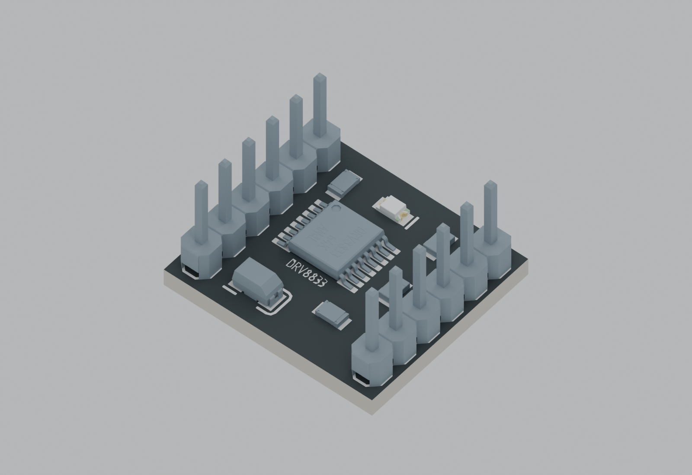

# DRV8833 12-pin motor driver module Altium library

Editable symbol and footprint for the 12-pin [DRV8833 module shown by the supplier](https://www.javanelec.com/shop/product/34544/non-brand/drv8833-module), based on the supplied STEP geometry. This library represents a module connector, not the pin numbering of the DRV8833 IC itself.

## 3D previews

| Model A (embedded in the footprint) | Model B (alternative header orientation) |
| --- | --- |
| [](3D/Preview_A.png) | [](3D/Preview_B.png) |

Rendered from the supplied STEP geometry with illustrative studio materials. These previews show the standalone models; they do not verify their placement on a host PCB in Altium.

## Symbol and footprint previews

| Schematic symbol preview | PCB footprint preview |
| --- | --- |
|  |  |

These are previews of the library files, not photographs or Altium Designer screenshots. [Persian documentation](README_FA.md) is also available.

## Files

| File | Contents |
| --- | --- |
| [DRV8833_Module.SchLib](DRV8833_Module.SchLib) | `DRV8833_MODULE` symbol with an explicit 12-pin footprint map |
| [DRV8833_Module.PcbLib](DRV8833_Module.PcbLib) | `DRV8833_MODULE_2X6_P254_R1524` footprint with STEP model A embedded |
| [Pin_Mapping.csv](Pin_Mapping.csv) | Pad numbers, labels, functions, and coordinates in millimeters |
| [Symbol_Preview.svg](Symbol_Preview.svg), [Footprint_Preview.svg](Footprint_Preview.svg) | Vector versions of the previews |
| [3D/](3D/) | Original STEP models A and B and PNG renders; model B has a different header orientation and is not embedded in the footprint |

## Use in Altium Designer

Keep the `.SchLib` and `.PcbLib` files together, then add them to an Altium project or install them as file-based libraries. Place `DRV8833_MODULE`; its symbol contains the footprint link. Inspect the embedded 3D model after transferring the part to a PCB. No compiled `.IntLib` is supplied.

## Orientation and pin numbering

The footprint is shown from the component side, with positive Y upwards. The supplier's photo of the bottom-side labels must be mirrored to compare with this top view. Pad 1 is square at the upper right.

```text
Top view                    Left X = -7.62 mm     Right X = +7.62 mm

EEP    7                           1  IN4   <- square pad
OUT1   8                           2  IN3
OUT2   9                           3  GND
OUT3  10                           4  VCC
OUT4  11                           5  IN2
ULT   12                           6  IN1
```

The board labels EEP and ULT are retained. EEP corresponds to active-low `nSLEEP`; ULT corresponds to active-low, open-drain `nFAULT`, represented as an open-collector output for schematic checking. The supplier PDF swaps these descriptions; their electrical functions were checked against the [Texas Instruments DRV8833 datasheet](https://www.ti.com/lit/ds/symlink/drv8833.pdf). The four IN pins are inputs and the four OUT pins are outputs.

## Mechanical details

| Item | Value |
| --- | --- |
| Pins | 2 x 6 |
| Pitch along each row | 2.54 mm |
| Row center spacing | 15.24 mm |
| Pad Y coordinates | +6.35, +3.81, +1.27, -1.27, -3.81, -6.35 mm |
| Module outline from STEP | 18.6 x 16.75 mm |
| Host pad / plated drill | 1.80 / 1.00 mm |
| Solder-mask expansion | 0.10 mm |

The pad and drill sizes are design choices. Top Overlay shows the outline, labels, and pad 1. Mechanical 13 shows the module outline; Mechanical 15 adds a 0.5 mm placement margin, **not** an electrical keepout. Mechanical 1 contains the 3D model body.

Embedded STEP model A uses original scale, zero rotation, and a +2.5 mm Z offset for direct male-header mounting. The module board bottom is approximately 2.5 mm above the host PCB and its top approximately 4.1 mm above it. Socket mounting needs a different height. The supplier PDF gives a nominal 18.5 x 16 mm size, while the supplied STEP geometry is 18.6 x 16.75 mm; this footprint follows the STEP model. Measure the actual module before fabrication.

## Verification status

The binary libraries were read back and checked for pin names, pad coordinates, plated holes, and 12 one-to-one pin/pad mappings. The embedded STEP was recorded as byte-identical to the supplied model A, and an independent structural reader reported no errors or warnings. Opening the files and transferring the part to a PCB in Altium Designer have **not** been verified. The supplied STEP headers identify Juan Manuel Dominici as their author.
