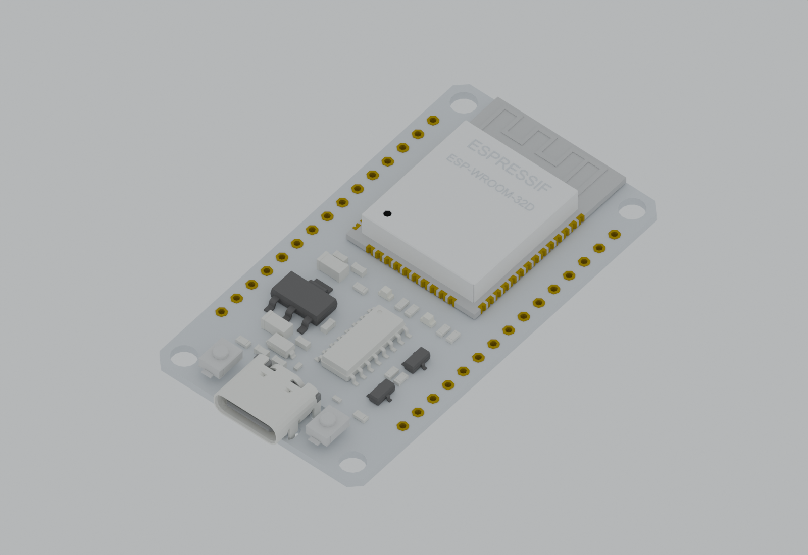

# ESP32 Type-C / CH340 30-pin Altium library

Editable symbol and footprint for a 30-pin ESP32 development board with USB-C at the bottom and the antenna at the top. This is the 15-pins-per-side variant represented in the supplied board image, not the 38-pin variant shown on some store pages. Match the labels and dimensions against your actual board before fabrication.

## 3D previews

| With headers (embedded in the footprint) | Without headers |
| --- | --- |
|  |  |

Rendered from the supplied STEP geometry with illustrative studio materials. These previews show the standalone models; they do not verify their placement on a host PCB in Altium.

## Symbol and footprint preview

The image is a 2D preview reconstructed from the library files, not a screenshot from Altium Designer or a photograph. [Persian documentation](README_FA.md) is also available.

## Files

| File | Contents |
| --- | --- |
| [ESP32_TypeC_30P.SchLib](ESP32_TypeC_30P.SchLib) | `ESP32_TYPEC_CH340_30P` schematic symbol with 30 pins |
| [ESP32_TypeC_30P.PcbLib](ESP32_TypeC_30P.PcbLib) | `ESP32_TYPEC_CH340_30P_P254_W2540` footprint with the header-equipped STEP model embedded |
| [ESP32_TypeC_30P.LibPkg](ESP32_TypeC_30P.LibPkg) | Project for compiling an integrated library |
| [PinMap.csv](PinMap.csv) | Pad numbers, board labels, GPIO names, sides, coordinates, and electrical types |
| [Verification.json](Verification.json) | Recorded structural checks and model placement values |
| [3D/](3D/) | Supplied STEP models with and without headers, plus PNG renders of both variants |

## Use in Altium Designer

Keep the `.SchLib`, `.PcbLib`, and `.LibPkg` files together. Open the `.LibPkg` project and compile an integrated library, or add both source libraries directly to your project. The symbol links to the footprint by name. After transfer to a PCB, use the 3D view to inspect the embedded model. No compiled `.IntLib` is supplied.

## Orientation and pin numbering

Viewed from above: antenna at the top, USB-C at the bottom. Pads 1 to 15 run down the left side from EN to VIN. Pads 16 to 30 run up the right side from 3V3 to D23. Pad 1 is square and marked by a triangle. These are module connector numbers, not ESP32-WROOM IC pin numbers. The symbol shows board labels together with GPIO names; VP/GPIO36, VN/GPIO39, GPIO34, and GPIO35 are input-only pins. See [Espressif's GPIO documentation](https://docs.espressif.com/projects/esp-faq/en/latest/software-framework/peripherals/gpio.html).

## Mechanical details

Dimensions below come from the supplied CAD model; they were not measured on a physical board.

| Item | Value |
| --- | --- |
| Pins | 2 x 15 |
| Pitch along each row | 2.54 mm |
| Row center spacing | 25.40 mm |
| First-to-last pad center distance | 35.56 mm |
| Module PCB outline | 28.60 x 51.90 mm |
| Host pad diameter | 1.80 mm |
| Host plated drill | 1.00 mm |
| Solder-mask expansion | 0.10 mm |

The 1.00 mm host drill was selected for a typical 0.64 mm square header pin; the module's own 0.90 mm hole was not copied to the host footprint. If you use a female socket, check its body and height separately. For direct header mounting, the model puts the module PCB top about 3.64 mm above the host PCB and the overall assembly top about 7.69 mm above it.

Top Overlay marks the outline, USB-C end, and pad 1. Mechanical 1 shows assembly details and four module holes as references; they do **not** create holes in the host PCB. Mechanical 15 shows an outline with 0.5 mm clearance. Mechanical 13 marks the antenna area as a reference drawing, **not** an electrical keepout. Provide antenna clearance in the host PCB layout according to the RF requirements.

## Verification status

The recorded checks found 30 symbol pins and 30 footprint pads with matching designators, checked row spacing and drill size, and reported zero structural errors or warnings. The embedded STEP was extracted and recorded as byte-identical to the supplied header model. Opening and compiling in Altium Designer have **not** been confirmed; the row spacing and mounting geometry have **not** been checked on physical hardware. Check both before ordering a PCB. The binary libraries were created with [altium-designer-mcp 1.2.0](https://github.com/embedded-society/altium-designer-mcp).
