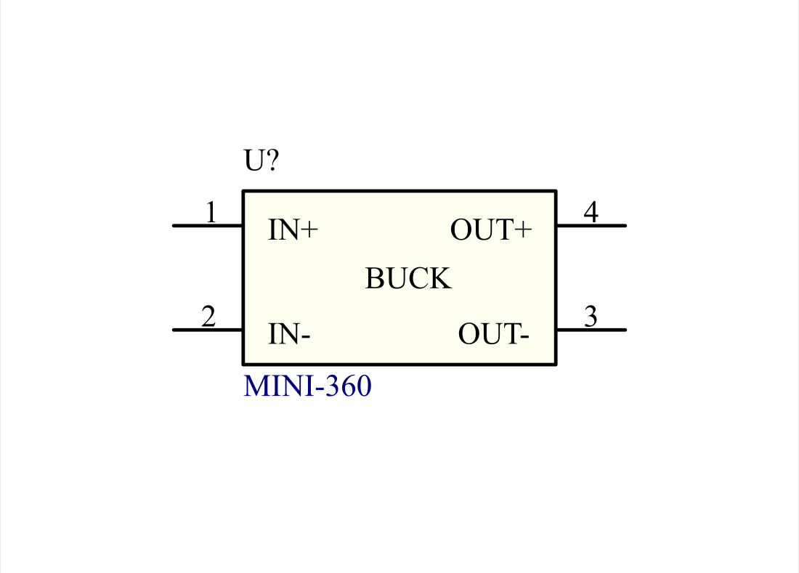
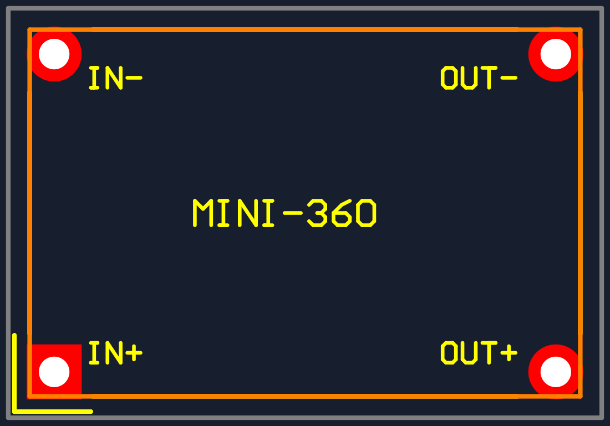
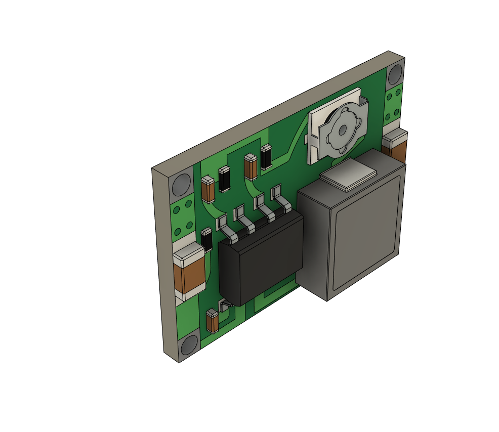

# MINI-360 buck converter module Altium library

Editable four-pin symbol and through-hole footprint for the MINI-360 module, using the supplied **HW-187 STEP model**. [Persian documentation](README_FA.md).

**Mechanical variant:** the supplied model is **18 x 12 mm**, with hole centers **16.4 x 10.4 mm** apart. The [ECA product page, item 3011015132](https://eshop.eca.ir/ماژول-تغذیه-ولتاژ-و-شارژ/14379-ماژول-رگولاتور-dc-به-dc-متغیر-کاهنده-2-آمپر-mini-360.html) lists **17 x 11 x 3.8 mm**. This footprint follows the supplied model, so measure the physical module before fabrication. No verified footprint for the smaller variant is included.

## Previews

| Schematic symbol | Footprint, component-side view |
| --- | --- |
|  |  |

Generated from the saved libraries; these are not Altium screenshots. Copper is red, silkscreen yellow, module outline orange, and placement margin gray. Pad 1 is square at the lower left. The mechanical outline is drawn over the segmented silkscreen in this combined preview.



This unmodified CAD preview was supplied in the ZIP. It depicts the standalone model without headers; it does not demonstrate the model's placement on a host PCB in Altium. [Top reference](3D/Top_Reference.png) and [bottom label reference](3D/Bottom_Reference.png) are also supplied.

## Files and use

| File | Contents |
| --- | --- |
| [MINI_360.LibPkg](MINI_360.LibPkg) | Source library project |
| [MINI_360_Module.SchLib](MINI_360_Module.SchLib) | `MINI_360_MODULE` symbol with four explicit pin-to-pad mappings |
| [MINI_360_Module.PcbLib](MINI_360_Module.PcbLib) | `MINI_360_4P_1640X1040` footprint with embedded STEP |
| [Pin_Mapping.csv](Pin_Mapping.csv) | Pin names, functions, and pad coordinates |
| [Verification.json](Verification.json) | Binary readback and model alignment checks |
| [3D/MINI_360_HW187.step](3D/MINI_360_HW187.step) | Original supplied STEP bytes, renamed for portability |
| [tools/build_library.py](tools/build_library.py) | Rebuild and verify with `altium-monkey==2026.9.22` |

Open `MINI_360.LibPkg` in Altium Designer and compile the source library project, or install the `.SchLib` and `.PcbLib` as file-based libraries. Place `MINI_360_MODULE` and select its linked footprint. Keep the source files together. The STEP is embedded in the footprint, so placing the component does not require an external model path. A compiled `.IntLib` is not included.

## Orientation and pin map

Top view, positive Y upward, IC on the left and inductor on the right; the adjustment potentiometer is at the upper right:

```text
                IN-  2                 3  OUT-
                x=-8.2                 x=+8.2      y=+5.2 mm

                       MINI-360

                IN+  1                 4  OUT+
                square                            y=-5.2 mm
```

Numbering is a library convention, not IC pin numbering. The underside labels in the supplied model must be mirrored when compared with this top view. The schematic places positive supply pins above returns for readability; its visual arrangement differs from the footprint, while the explicit pin map preserves the connections. IN- and OUT- are the common return of this non-isolated module. All four symbol pins use Altium's Power electrical type.

## Mechanical details

| Item | Value |
| --- | --- |
| Model outline / overall height | 18 x 12 mm / approximately 3.75 mm |
| Hole-center spacing | 16.4 mm along X; 10.4 mm along Y |
| Model hole diameter | 1.20 mm |
| Host pad / plated drill | 1.80 / 1.00 mm |
| Solder-mask expansion | 0.10 mm, manual |
| Module board bottom above host surface | 2.00 mm nominal |
| Highest model point above host surface | 5.75 mm nominal |
| Placement outline | 19.4 x 13.4 mm |

Pads and drills are design choices for four separate soldered pins or wires. These spacings do not correspond to a standard 2.54 mm header grid. The supplied model contains no mounting pins or sockets; provide suitable hardware and support at the documented height.

Top Overlay carries segmented outline lines, connection names, and a pin-1 marker. Mechanical 13 carries the module outline. Mechanical 15 adds 0.7 mm around the module as a placement margin, **not an electrical keepout**. Mechanical 1 carries the embedded 3D body. Keep the area beneath the module clear of components unless checked against the actual mounting arrangement, and preserve access to the adjustment potentiometer.

The original STEP's board plane is at Z = 16 mm. Placement uses scale 1, rotation Z = -90 degrees, XY translation (-0.133657042013, -0.631833289516) mm, and Z offset -14 mm. These values center the board and align its four hole axes with the pads. Change the body height and Z offset if using a different mounting height.

## Electrical source and variant limits

The ECA specifications list 4.75-23 V input, adjustable 1-17 V output, and 1.8 A continuous / 2 A peak output. Its prose also mentions 3 A, so the library records the lower tabulated rating. The page identifies MP1482, while the supplied archive is named `mini-360-mp2307-1.snapshot.5.zip`; the model underside says HW-187. The actual controller is unconfirmed. This library represents the module's four terminals and does not assert a particular IC or its protections.

## Verification and provenance

The saved binary files were read back successfully. Checks cover four pin names, four pad designators and coordinates, plated 1.00 mm drills, the footprint link, and four explicit one-to-one pin mappings. The embedded STEP is byte-identical to the supplied file. The saved 3D transform was checked, and the four 1.20 mm cylindrical hole axes extracted from STEP align with the saved footprint pads within 0.00001 mm. Preview layout was inspected.

**Opening, compiling, schematic-to-PCB transfer, and 3D display in native Altium have not been verified. No physical module has been measured.** The model/supplier size disagreement remains unresolved.

The STEP and reference PNGs came from the user-supplied ZIP. Its header identifies ST-DEVELOPER v18 and Autodesk Translation Framework v8.6.0.1094, with a 2019-10-29 export timestamp; author and organization are blank. The header's historical export path is metadata, not a runtime dependency. No redistribution license was supplied; see [third-party notices](../../THIRD_PARTY_NOTICES.md). The generated symbol, footprint, pin map, and documentation are repository contributions; third-party model rights remain separate.
