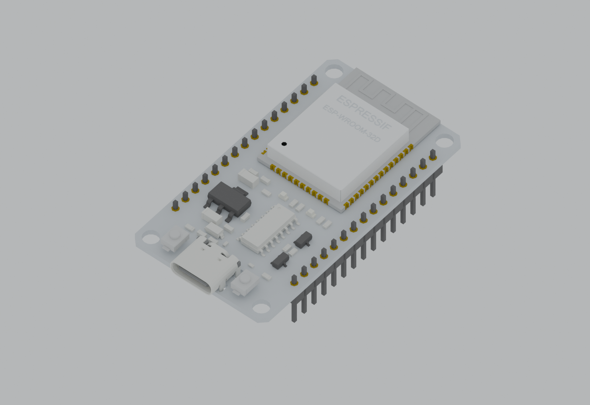
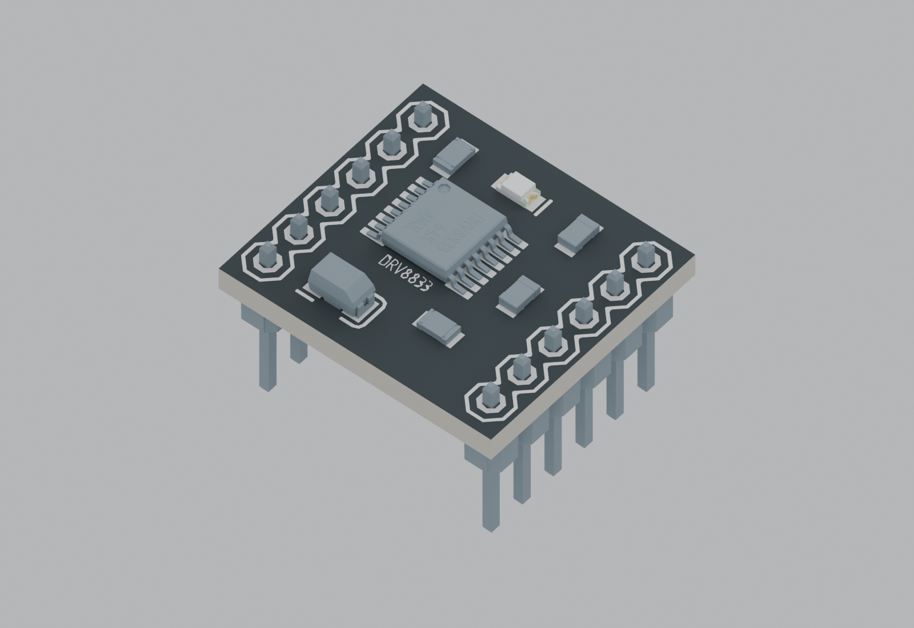
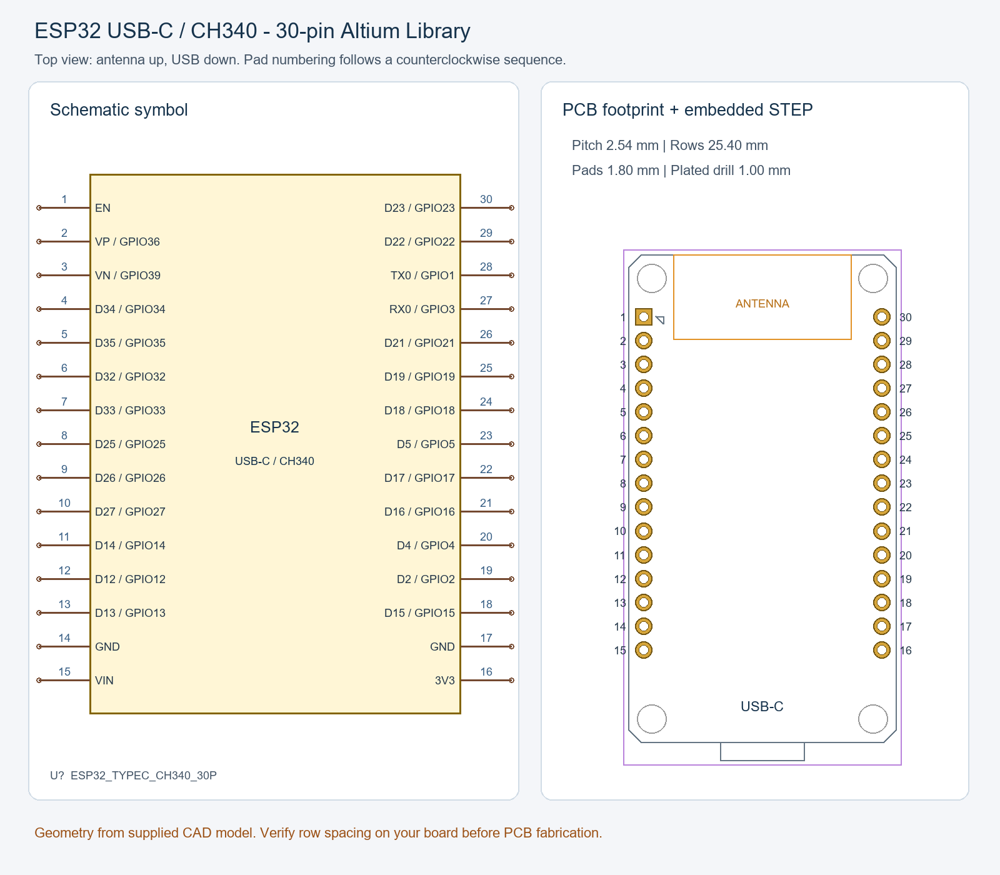
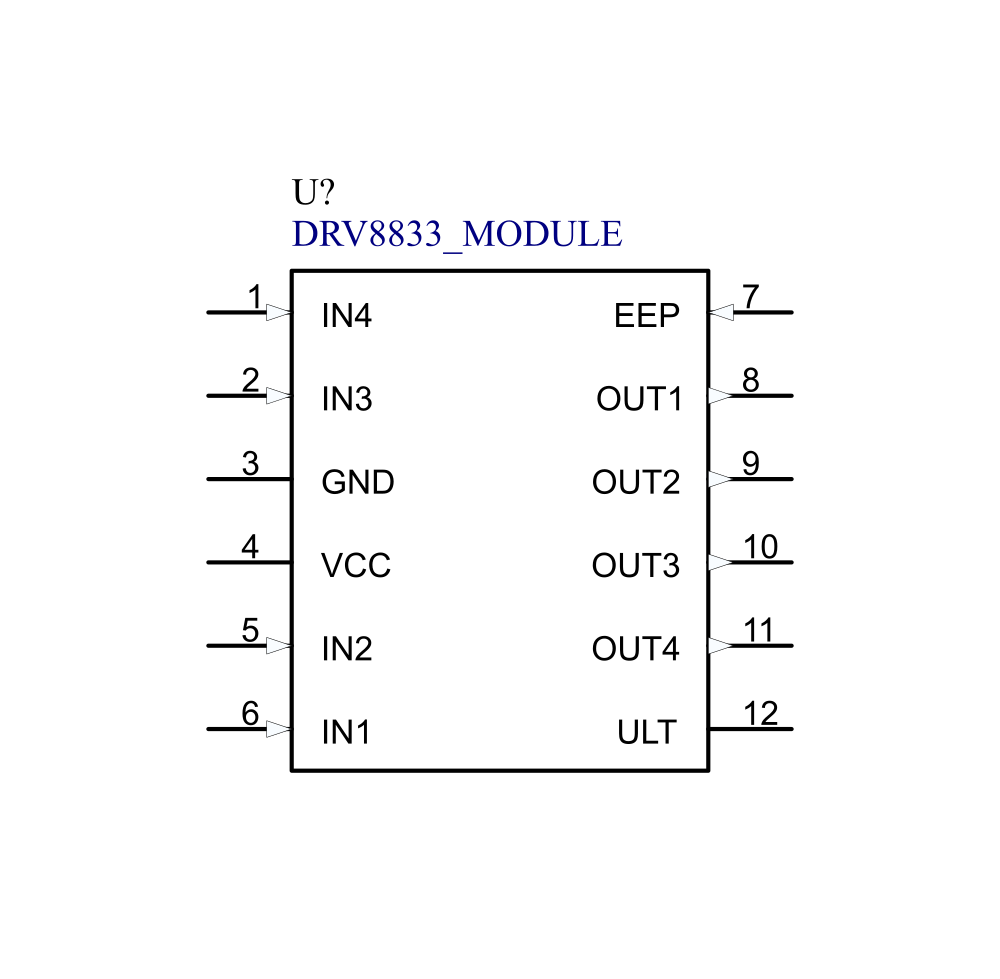
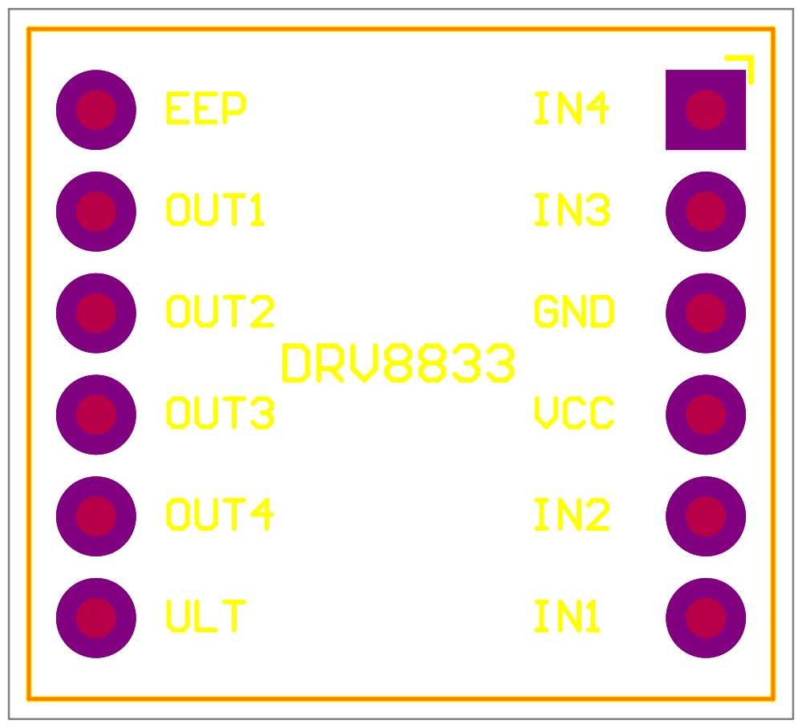

# Altium-lib

Editable Altium Designer libraries for development boards and modules. Each library has schematic and PCB source files, a pin map, documentation, and preview images. STEP models are included where available.

## Libraries

| Library | Description | Files | Verification |
| --- | --- | --- | --- |
| [ESP32 Type-C 30-pin](ESP32_TypeC_30P/ESP32_TypeC_30P/README.md) | ESP32 development board with USB-C and CH340; 15 pins per side | SchLib, PcbLib, LibPkg, STEP, pin map, preview | Pin/pad mapping and file structure checked; native Altium compilation not verified |
| [DRV8833 module](DRV8833/DRV8833_Altium/README.md) | 12-pin DRV8833 motor driver module | SchLib, PcbLib, STEP, pin map, previews | Pin/pad mapping and file structure checked; native Altium opening not verified |

## 3D model previews

| ESP32 with headers | DRV8833 model A |
| --- | --- |
|  |  |

These are CAD renders of the STEP models embedded in the footprints, with illustrative studio materials. The library pages also show the alternative models.

## Symbol and footprint previews

### ESP32 Type-C 30-pin

### DRV8833 module

| Schematic symbol | PCB footprint |
| --- | --- |
|  |  |

These images are library previews, not photographs or screenshots from Altium Designer. The library READMEs contain pin orientation, dimensions, model details, and verification limits.

## Using a library

1. Download or clone the complete folder for the required library.
2. Keep its `.SchLib` and `.PcbLib` files together. Open the `.LibPkg` where provided, or add the source libraries to your Altium project.
3. Select the documented symbol and footprint. Check the 3D view after placing the part on a PCB.
4. Before fabrication, compare the pin order, row spacing, board outline, hole sizes, and mounting height with the physical module you will use.

## Adding a library

See [CONTRIBUTING.md](CONTRIBUTING.md) and the [new-library guide](docs/ADD_NEW_LIBRARY.md). Keep each part or module in its own folder, add an English `README.md` with a visible preview, and register it in [LIBRARY_INDEX.csv](LIBRARY_INDEX.csv). Existing folder names do not need to be changed to match the recommended structure.

## License and verification

The repository has an [MIT license](LICENSE) for its original contributions. The redistribution terms of the supplied STEP models have not been documented; see [third-party notices](THIRD_PARTY_NOTICES.md) and confirm their permissions before public release. Automated checks are recorded in each library's documentation where available; opening, compiling, placement, and 3D display in Altium Designer have not yet been verified in this repository. Review the source datasheet and the actual module before using a footprint in production.
