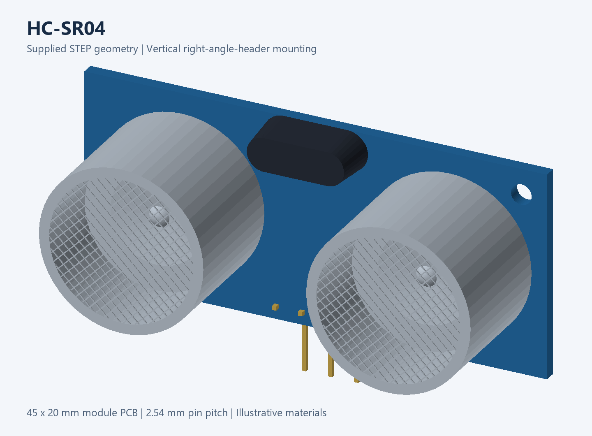

# Altium module libraries

Editable Altium Designer libraries for development boards and modules, with schematic symbols, PCB footprints, STEP models, pin maps and previews.

## Library catalog

| Module | Description | Package | Documentation |
| --- | --- | --- | --- |
| **ESP32 Type-C 30-pin** | USB-C / CH340 development board; 15 pins per side | SchLib · PcbLib · LibPkg · STEP | [English](ESP32_TypeC_30P/ESP32_TypeC_30P/README.md) · [فارسی](ESP32_TypeC_30P/ESP32_TypeC_30P/README_FA.md) |
| **DRV8833** | 12-pin motor driver module | SchLib · PcbLib · LibPkg · STEP | [English](DRV8833/DRV8833_Altium/README.md) · [فارسی](DRV8833/DRV8833_Altium/README_FA.md) |
| **MINI-360** | Four-terminal buck converter; supplied HW-187 model variant | SchLib · PcbLib · LibPkg · embedded STEP | [English](MINI_360/MINI_360_Altium/README.md) · [فارسی](MINI_360/MINI_360_Altium/README_FA.md) |
| **HC-SR04** | Four-pin ultrasonic module; vertical mounting with right-angle header | SchLib · PcbLib · LibPkg · embedded STEP | [English](SRF04/HC_SR04_Altium/README.md) · [فارسی](SRF04/HC_SR04_Altium/README_FA.md) |

Each package includes its pin map and preview images. The [CSV index](LIBRARY_INDEX.csv) provides machine-readable paths. The existing `SRF04` folder contains the **HC-SR04** package; this is a four-pin module.

## 3D gallery

| ESP32 Type-C 30-pin | DRV8833 |
| --- | --- |
|  |  |

| MINI-360 | HC-SR04 |
| --- | --- |
|  |  |

These are CAD previews. ESP32, DRV8833 and HC-SR04 renders use illustrative materials; MINI-360 uses the unmodified supplied preview. Click an image for model details and alternative variants.

## Symbol and footprint previews

| Module | Preview |
| --- | --- |
| [ESP32 Type-C 30-pin](ESP32_TypeC_30P/ESP32_TypeC_30P/README.md) | [Combined symbol and footprint](ESP32_TypeC_30P/ESP32_TypeC_30P/Preview.png) |
| [DRV8833](DRV8833/DRV8833_Altium/README.md) | [Symbol](DRV8833/DRV8833_Altium/Symbol_Preview.png) · [Footprint](DRV8833/DRV8833_Altium/Footprint_Preview.png) |
| [MINI-360](MINI_360/MINI_360_Altium/README.md) | [Symbol](MINI_360/MINI_360_Altium/Symbol_Preview.png) · [Footprint](MINI_360/MINI_360_Altium/Footprint_Preview.png) |
| [HC-SR04](SRF04/HC_SR04_Altium/README.md) | [Symbol](SRF04/HC_SR04_Altium/Symbol_Preview.png) · [Footprint](SRF04/HC_SR04_Altium/Footprint_Preview.png) |

Each library guide embeds these previews and explains pin orientation, dimensions and mounting. The images are library previews, not Altium Designer screenshots.

## Getting started

1. Download or clone the complete folder for the required library.
2. Keep `.SchLib` and `.PcbLib` together. Open the `.LibPkg` where provided, or add the source libraries to your Altium project.
3. Select the documented symbol and footprint, transfer the part to your PCB and inspect the 3D view.
4. Compare pin order, header spacing, holes, outline and mounting height with your actual module before fabrication.

## Verification

| Module | Completed checks | Remaining checks |
| --- | --- | --- |
| ESP32 Type-C 30-pin | Pin/pad mapping and file structure | Native Altium compilation and hardware measurements |
| DRV8833 | Pin/pad mapping and file structure | Native Altium opening and hardware measurements |
| MINI-360 | Pin/pad mapping and STEP hole alignment | Native Altium and hardware measurements; supplied model is 18 × 12 mm versus supplier's 17 × 11 mm |
| HC-SR04 | Pin/pad mapping, saved model transform, STEP header/pad alignment and embedded model identity | Native Altium, hardware measurements and STEP pin function orientation |

Details and verification limits are recorded in each library guide and available `Verification.json` files.

## Contributing

See [CONTRIBUTING.md](CONTRIBUTING.md) and the [new-library guide](docs/ADD_NEW_LIBRARY.md). Keep each module in its own folder, provide an English README with previews, and register it in [LIBRARY_INDEX.csv](LIBRARY_INDEX.csv). Existing folder paths remain stable.

## License and asset sources

Original contributions use the [MIT license](LICENSE). Supplied third-party assets have separate, undocumented redistribution terms; their available source information is recorded in [THIRD_PARTY_NOTICES.md](THIRD_PARTY_NOTICES.md).
