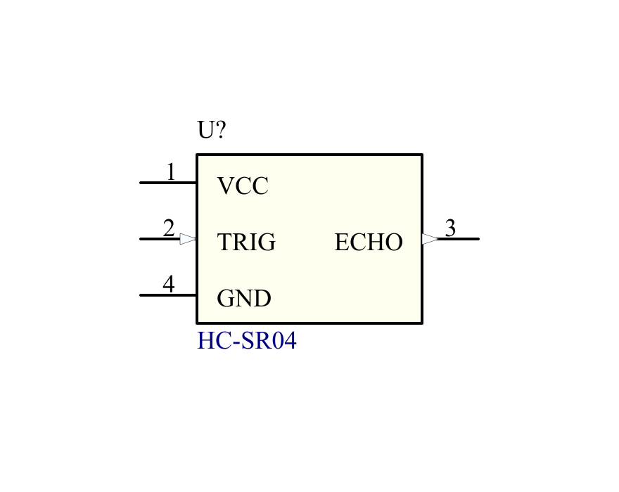
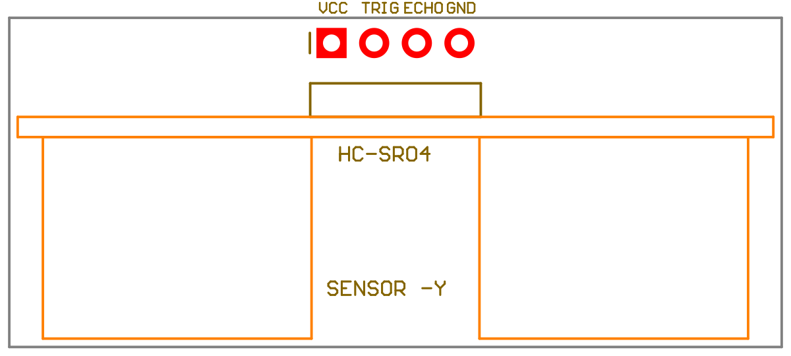

# کتابخانهٔ آلتیوم ماژول HC-SR04

کتابخانهٔ قابل‌ویرایش ماژول التراسونیک **HC-SR04 چهارپایه**، با شماره‌گذاری و گام پایه‌های فایل IntLib پیوست و مدل STEP جاسازی‌شده در فوت‌پرینت. این مدل با SRF04 یا HC-SRF05 پنج‌پایه متفاوت است. نام پوشهٔ موجود `SRF04` حفظ شده است.

[راهنمای انگلیسی](README.md) · [جدول پایه‌ها](Pin_Mapping.csv) · [گزارش بررسی](Verification.json)

## پیش‌نمایش‌ها

رندر هندسهٔ واقعی فایل پیوست با رنگ نمایشی؛ مدل روی PCB میزبان به‌صورت عمودی قرار می‌گیرد و سنسورها به سمت Y منفی هستند.

| نماد شماتیک | فوت‌پرینت از بالای PCB میزبان |
| --- | --- |
|  |  |

## نصب و استفاده

1. پوشهٔ کامل `HC_SR04_Altium` را دریافت کنید و فایل‌های آن را کنار هم نگه دارید.
2. فایل [HC_SR04.LibPkg](HC_SR04.LibPkg) را در آلتیوم باز و کامپایل کنید؛ یا فایل‌های SchLib و PcbLib را به پروژه اضافه کنید.
3. نماد `HC_SR04_MODULE` را با فوت‌پرینت `HC_SR04_VERTICAL_1X4_P254` قرار دهید.
4. پس از انتقال به PCB، نمای سه‌بعدی را بررسی کنید. مدل داخل PcbLib است و به مسیر خارجی وابسته نیست.

فایل IntLib پیوست برای مرجع پایه‌ها استفاده شده است. مطابق ساختار مخزن، فایل‌های قابل‌ویرایش منتشر می‌شوند؛ IntLib کامپایل‌شده در Git ثبت نمی‌شود.

## پایه‌ها

در نمای بالا، Y مثبت رو به بالا است؛ پد ۱ مربع است و بدنهٔ ماژول در سمت Y منفی قرار دارد.

| پایه | نام | نقش | X، میلی‌متر | Y، میلی‌متر |
| --- | --- | --- | --- | --- |
| 1 | VCC | تغذیهٔ ۵ ولت | −3.81 | 0 |
| 2 | TRIG | ورودی تحریک | −1.27 | 0 |
| 3 | ECHO | خروجی پالس فاصله | +1.27 | 0 |
| 4 | GND | زمین تغذیه | +3.81 | 0 |

نوع الکتریکی TRIG و ECHO در فایل مرجع I/O بود؛ در این کتابخانه به‌ترتیب Input و Output تنظیم شده است. مشخصات الکتریکی با [دیتاشیت HC-SR04 در SparkFun](https://cdn.sparkfun.com/datasheets/Sensors/Proximity/HCSR04.pdf) تطبیق داده شده‌اند. سطح سیگنال ECHO را با ورودی میکروکنترلر تطبیق دهید. برچسب الکتریکی پایه‌های مدل STEP تأیید نشده؛ جهت واقعی VCC و GND را روی نمونهٔ خود بررسی کنید.

## ابعاد و جهت مدل

- هدر: یک ردیف چهارپایه با گام ۲٫۵۴ میلی‌متر؛ پد ۱٫۸ و سوراخ آبکاری‌شدهٔ ۱٫۰۲ میلی‌متر.
- برد مدل پیوست: ۴۵ × ۲۰ × ۱٫۲ میلی‌متر؛ ارتفاع در نصب عمودی: ۲۰ میلی‌متر.
- مدل دارای هدر زاویه‌دار است؛ چرخش X برابر مثبت ۹۰ درجه و جابه‌جایی Y برابر منفی ۱۰٫۰۵ میلی‌متر، پایه‌های آزاد هدر را روی پدها قرار می‌دهد.
- سنسورها به سمت Y منفی هستند. محدودهٔ جانمایی: X از منفی ۲۳ تا مثبت ۲۳ و Y از منفی ۱۸٫۱ تا مثبت ۱٫۵ میلی‌متر.
- نوک پایه‌های مدل ۷٫۵۳ میلی‌متر زیر سطح PCB میزبان است؛ فضای زیر برد را در نظر بگیرید.
- Mechanical 13 تصویر مکانیکی برد و سنسورها، Mechanical 15 حاشیهٔ جانمایی و Mechanical 1 بدنهٔ سه‌بعدی است. محدودهٔ مکانیکی keepout الکتریکی نیست.
- دو سوراخ مورب ۲ میلی‌متری مدل روی برد عمودی ماژول قرار دارند و در PCB میزبان سوراخ ایجاد نمی‌کنند.

این فوت‌پرینت برای نصب عمودی مدل پیوست با هدر زاویه‌دار ساخته شده است. نصب روی سوکت یا هدر صاف نیازمند تنظیم مدل و ارتفاع متناسب با قطعهٔ واقعی است. مسیر صوتی سنسورها را باز نگه دارید.

## بررسی و منبع فایل‌ها

کتابخانه‌های ذخیره‌شده بازخوانی شدند؛ شماره و نام پایه‌ها، مختصات پدها، سوراخ‌ها، پیوند فوت‌پرینت و نگاشت یک‌به‌یک بررسی شد. مدل جاسازی‌شده بایت‌به‌بایت با STEP پیوست یکسان است. مراکز انتهای آزاد پایه‌های مدل پس از چرخش و جابه‌جایی با هر چهار پد تطبیق داده شدند.

بازشدن، کامپایل و نمایش سه‌بعدی در خود آلتیوم هنوز تأیید نشده و نمونهٔ فیزیکی اندازه‌گیری نشده است. مسیرهای شخصی موجود در IntLib مرجع به فایل‌های جدید منتقل نشده‌اند.

هدر STEP نرم‌افزار SolidWorks 2017 و تاریخ خروجی 2020-03-15 را نشان می‌دهد؛ نام سازنده و مجوز بازنشر در پیوست‌ها مشخص نیست. اطلاعات موجود در [اعلامیهٔ منابع ثالث](../../THIRD_PARTY_NOTICES.md) ثبت شده است.
